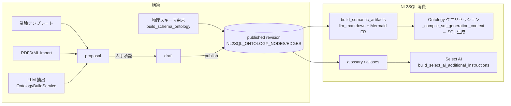

# Ontology-Playground 学習ノートと本プロジェクトへの複製方針

> 調査対象: [microsoft/Ontology-Playground](https://github.com/microsoft/Ontology-Playground)(MIT、TypeScript 静的 Web アプリ)
> 本書の目的: Playground の**構築過程・構築方法・graph 表現**を整理し、その手法を **Production Ready NL2SQL の既存 Ontology 機能へ複製(再マップ)する方針**を示す。
> 重要: Playground 自体は **SQL を生成しない**。NL2SQL のグラウンディング対象となるセマンティックレイヤー(オントロジー)の**オーサリング/学習ツール**であり、実クエリ変換は Microsoft Fabric IQ 側へ委譲される。

---

## 1. Ontology-Playground の構築過程(3 経路)

### 経路 A: 手動ビジュアルデザイナー + 業種テンプレート

- `src/data/designerTemplates.ts` に 5 業種テンプレート(Retail / Healthcare / Finance / IoT / Education)。ゼロからも作成可。
- split-pane エディタでエンティティ型(アイコン・色・型付きプロパティ)とリレーション(カーディナリティ)を定義。ライブグラフプレビュー、Undo/Redo、リアルタイムバリデーション。
- テンプレートは**決定論データ**(LLM 不使用)であり、「まず雛形を置いてから業務に合わせて編集する」導線を提供する。

### 経路 B: LLM による業務シナリオ→オントロジー抽出

- 実装: `api/generate-ontology/index.ts`(Azure Functions + Azure OpenAI `gpt-4o-mini`、JSON mode、`temperature: 0.3`)。
- **入力は DB スキーマではなく「業務シナリオの自然言語記述」**。
- System プロンプトの抽出ルール(要旨):
  1. 文中の**名詞**をエンティティ、**動詞**をリレーションとして抽出する
  2. 各エンティティは `isIdentifier: true` のプロパティ(主識別子)を**最低 1 つ**持つ
  3. リレーションには **cardinality を必ず付与**する
  4. 出力は固定 JSON スキーマ(`entityTypes[]` / `relationships[]`)で、パース後に必須フィールドを検証する
- ポイント: **抽出ルールをプロンプトで明文化し、出力を構造化スキーマで検証する**という「LLM 抽出 + 決定論検証」の 2 段構え。

### 経路 C: 外部 RDF/OWL のインポート

- 既存の RDF/OWL ファイル(FIBO 由来のサンプル等)をカタログへ取り込む。
- **round-trip 忠実性テスト**(RDF → 内部モデル → RDF で情報が失われないこと)を CI で保証する。

## 2. 表現方法(オントロジーのデータモデルと OWL 正本)

内部モデル(`src/data/ontology.ts`):

| 概念 | 内容 |
|---|---|
| `EntityType` | id / name / description / properties / icon / color |
| `Property` | name / type(string, integer, decimal, double, date, datetime, boolean, enum)/ `isIdentifier` / unit / enum values |
| `Relationship` | id / name / from / to / cardinality(one-to-one, one-to-many, many-to-one, many-to-many)/ 属性 |

正本フォーマットは **RDF/XML(OWL 2)**。マッピング(`src/lib/rdf/serializer.ts`):

- `EntityType` → `owl:Class`(`rdfs:label` / `rdfs:comment`)
- `Property` → `owl:DatatypeProperty`(`rdfs:domain` = クラス、`rdfs:range` = XSD 型)
- `Relationship` → `owl:ObjectProperty`(domain/range + カスタム注釈 `ont:cardinality`)

カタログは 1 オントロジー = `<slug>.rdf` + `metadata.json`(name / description / icon / category / tags / author)のペアで管理する。

## 3. graph 表現と決定論 NL クエリマッピング

- 可視化は **Cytoscape.js**(ノード = エンティティ、エッジ = リレーション)。**グラフ DB・SPARQL エンジンは持たない**。オントロジーはインメモリ TS オブジェクト + RDF ファイルのみ。
- 「Natural Language Query Playground」(`src/data/queryEngine.ts`)は **LLM を呼ばない決定論の段階マッチング**で、NL 質問をグラフ要素のハイライトへ写像する(SQL 非生成):
  1. 正規化(小文字化・冠詞除去 `stripLeadingArticle`・単複吸収 `singularize`)
  2. エンティティ定義質問("What is a customer?")→ 該当ノードをハイライト
  3. 一覧質問("show me all orders")→ 該当ノード
  4. リレーション辿り("Which customers placed orders?")→ `relationships.filter(r => r.from === entity.id || r.to === entity.id)` で両端 + エッジをハイライト
  5. プロパティ質問 → 該当プロパティ
- 返り値は `highlightEntities` / `highlightRelationships` + 説明文。**「NL がオントロジーのどこに接地するか」を人に見せる**ことが目的。

## 4. Playground 概念 → 本プロジェクト実装の対応表

本プロジェクトの Ontology 機能(`backend/app/features/nl2sql/ontology_*.py`)は多くの面で Playground より先行している。対応と相違:

| Playground | 本プロジェクト | 備考 |
|---|---|---|
| `EntityType` | `OntologyNode(kind=BUSINESS_ENTITY)` | **物理 object への mapping 必須**(相違点。抽象エンティティは `BUSINESS_TERM` へ縮退) |
| `Property`(型付き) | `OntologyNode(kind=PROPERTY)` + DOMAIN/RANGE エッジ、`data_type` | `ontology_models.py` |
| `isIdentifier` | 専用フィールドなし | 抽出プロンプトで主識別子を `description_ja` へ明記させる(§5 Gap 4) |
| `Relationship` + cardinality | `OntologyEdge(kind=BUSINESS_RELATIONSHIP)` + `RelationshipCardinality` | **join_conditions 必須 + 列実在検証**(相違点・本プロジェクトの強み) |
| enum values | `ENUM_VALUE` ノード | |
| synonym(専用フィールドなし、文字列操作で吸収) | ノード `aliases` + プロファイル glossary | 本プロジェクトの方が明示的 |
| RDF/XML カタログ(`<slug>.rdf` + `metadata.json`) | `serialize_owl_turtle`(Turtle)+ Oracle RDF ステージング(`SDO_RDF_TRIPLE_S`)+ 本複製の RDF/XML export/import | §5 Gap 2 |
| 業種テンプレート(`designerTemplates.ts`) | 本複製のテンプレートカタログ(`ontology_templates/*.json`) | §5 Gap 1 |
| Azure OpenAI 抽出(`generate-ontology`) | `OntologyBuildService`(OCI Enterprise AI)+ `OntologyBuildExtraction`(Pydantic 検証) | 抽出ルールを取り込み(§5 Gap 4) |
| `queryEngine.ts`(決定論 NL マッピング) | 本複製の `queryPlayground.ts`(frontend 純関数) | §5 Gap 3 |
| Cytoscape.js | ReactFlow(`OntologyGraphCanvas.tsx`) | 既存 canvas へ highlight props 追加 |
| Fabric IQ エクスポート | **非対象**。代わりに `build_semantic_artifacts().llm_markdown` が Select AI `additional_instructions` / Ontology クエリセッションの SQL 生成文脈へ流れる | §6 |
| 人手確認なし(即時編集) | draft → proposal(人手承認)→ publish revision | 相違点・本プロジェクトの強み |
| 推論・検証なし | OWL2RL 推論 + SHACL 検証(`ontology_reasoning.py` / `ontology_semantics.py`) | 本プロジェクトが先行 |

## 5. 複製方針(本プロジェクトへの取り込み)

確定スタック(OCI Enterprise AI / Oracle 26ai)へ再マップし、**既存の draft → proposal → publish ライフサイクルと proposal 変換パイプ(`OntologyBuildExtraction` → `convert_extraction_to_proposals` → `create_build_proposal`)を再利用**する。新規 DDL・新規依存・スタンドアロンアプリは作らない。

- **Gap 1: 業種テンプレートカタログ** — Playground の `designerTemplates` 相当。`backend/app/features/nl2sql/ontology_templates/*.json`(小売/製造/金融/医療/人事、決定論データ)を 1 クリックで proposal 群として適用する。エンティティは `object_name_hint`(+ユーザー override)で物理 object へ名前解決し、解決不能分は `BUSINESS_TERM` proposal + warning へ縮退する。
- **Gap 2: RDF/XML (OWL) export / import** — Playground のカタログ互換。export は既存 `serialize_owl_turtle` の出力へ `ont:cardinality` 注釈を後付けし rdflib で RDF/XML 化(既存シリアライザ・artifact hash は非変更)。import は `owl:Class` → エンティティ候補、`owl:ObjectProperty` → リレーション候補として proposal 化し、人手レビューゲートを通す。round-trip 忠実性テストを持つ。
- **Gap 3: 決定論 NL Query Playground** — `queryEngine.ts` の日本語移植。frontend 純関数 `answerOntologyQuestion(graph, question)` が正規化 → alias 最長一致 → 定義/一覧/関係辿り/プロパティの段階マッチングでハイライト対象を返し、既存 `OntologyGraphCanvas` 上で減光+枠強調表示する。LLM 呼び出しなし。
- **Gap 4: LLM 抽出プロンプト改善** — Playground の抽出ルール(名詞→エンティティ、動詞→リレーション、cardinality 必須、主識別子明記)を `ontology_build.py` の抽出プロンプトへ反映する。スキーマ・パーサは既存のまま。

## 6. 構築後オントロジーの NL2SQL での利用(既存経路・無変更)

テンプレート適用・RDF import で作られた proposal は、人手承認 → draft → publish を経て既存の 2 経路でそのまま消費される:

- **経路 1(Select AI)**: `service.py` の `build_select_ai_additional_instructions` が業務用語集(glossary)・SQL 生成ルールを DBMS_CLOUD_AI プロファイルの `additional_instructions` へ注入。
- **経路 2(Ontology クエリセッション)**: `ontology_router.py` の `_compile_sql_generation_context` が許可オブジェクト・承認済み結合パス(join_conditions)・指標定義・`llm_markdown`・Mermaid ER を束ねて SQL 生成文脈を構築。
- 決定論 NL Playground(Gap 3)は経路 2 の `_interpret_question` の**前段の可視化・デバッグ手段**として機能する(質問がどのノード/エッジに接地するかを LLM なしで確認できる)。
